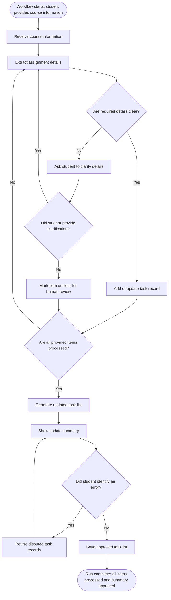

# Workflow of Tasks

## 1.1 Link to System Goal

See the [HackTrack system goal](../README.md#system-goal).

## 1.2 Workflow Trigger

The workflow starts when a BUS 4498 student provides HackTrack with an assignment announcement, syllabus excerpt, or task list for a weekly tracker update.

## 1.3 Completion Condition at Runtime

A run is complete when every provided course item has been reviewed, each item has either been added or updated with its title, due date, and status or marked unclear for human review, and HackTrack has shown the student an update summary with any requested corrections applied.

## 1.4 General Workflow

HackTrack receives the student's course information and extracts each assignment title, due date, and status. For each item, it checks whether the required details are clear and compares the item with the existing task list. Clear items are added or updated. If details are missing or ambiguous, HackTrack asks the student to clarify them; clarified information is processed again, while an item that remains unresolved is marked unclear for human review. The workflow continues until every provided item has been processed.

HackTrack then generates an updated task list and shows an update summary. The student reviews the summary. If the student identifies an error, HackTrack revises the disputed task records and shows the summary again. When no further error is identified, HackTrack saves the approved task list and ends the run. HackTrack does not submit assignments or change Canvas records.

## 1.5 Workflow Diagram

